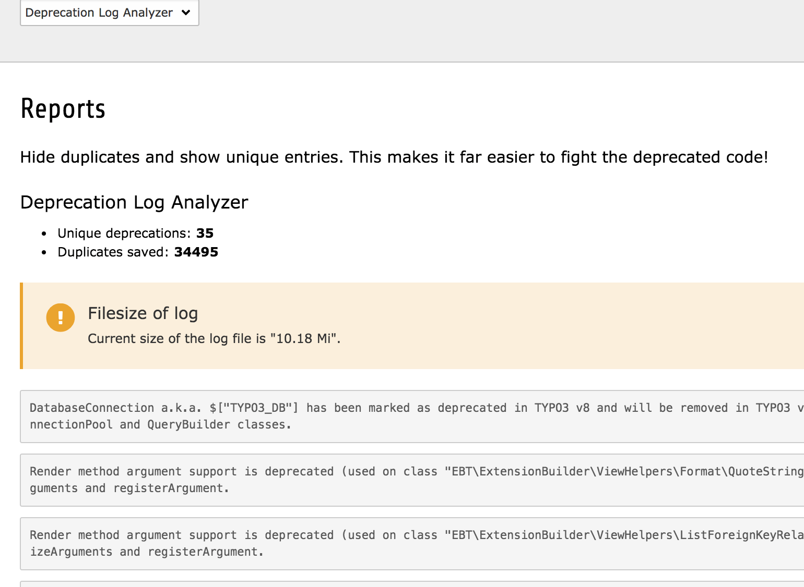

.. ==================================================
.. FOR YOUR INFORMATION
.. --------------------------------------------------
.. -*- coding: utf-8 -*- with BOM.

TYPO3 CMS Extension "deprecationloganalyzer"
============================================
The deprecation log is a highly useful feature which tells you if deprecated code is currently in use.
There is only one side effect when enabling the deprecation log: The filesize can grow very fast if you got either many deprecation code in use or only some but a very often visited site.

Therefore it is very hard to analyze the log file. The extension **deprecationloganalyzer** tries to help you by filtering the duplicates. Instead of searching a 500mb file, you will see only 11 unique errors.

Screenshot
----------

Donations
---------
Visit my `Amazon whishlist <https://www.amazon.de/registry/wishlist/8F573K08TSDG/>`_, donate some money via paypal or just say "thank you". This would be great!

Requirements
------------
- TYPO3 CMS 6.2, 7.6, 8.7

Installation
------------
The extension just needs to be installed as any other extension. Either use the extension manager or composer ::

   composer require georgringer/deprecationloganalyzer

Usage
-----
Switch to the module **Reports** and select *Deprecation Log Analyzer*.

